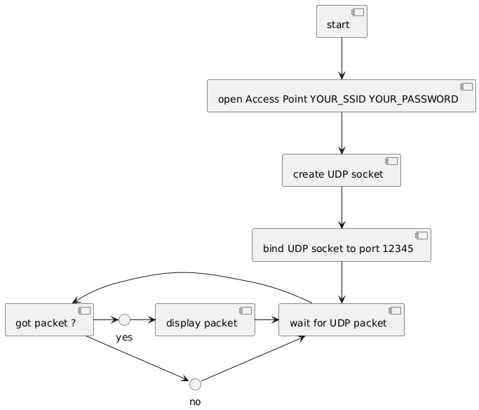

# AP-UDP-Receiver



A simple UDP server that runs on an ESP32/ESP8266, creating its own WiFi Access Point to receive and log UDP packets.

## Features

- Creates a WiFi Access Point (AP) for direct device connection
- Listens for UDP packets on a configurable port (default: 12345)
- Logs received packets with timestamp and sender information
- Handles non-printable characters in received data
- Automatic restart on critical failures
- Configurable network settings

## Hardware Requirements

- ESP32 or ESP8266 board
- USB cable for programming and power
- 2x digital output devices (e.g., LEDs, relays) for X and Y axis control

## Pinout

The following GPIO pins are used in this project:

| Pin | Function      | Description                     |
|-----|---------------|---------------------------------|
| 25  | X-axis output | Controls the X-axis output      |
| 26  | Y-axis output | Controls the Y-axis output      |
| 3V3 | 3.3V Power    | Power for connected devices     |
| GND | Ground        | Common ground for all components|


## Installation

1. Clone this repository
2. Open the project in Arduino IDE or PlatformIO
3. Install required libraries (if any)
4. Upload the sketch to your board
5. Open the Serial Monitor (115200 baud) to view logs

## Configuration

Edit the following constants in `AP-UDP-Receiver.ino` to customize the behavior:

```cpp
const char* SSID = "AP-UDP-Receiver";    // Access Point SSID
const char* PASSWORD = "12345678";       // Password (min 8 chars)
const uint16_t LOCAL_UDP_PORT = 12345;   // UDP port to listen on
const size_t BUFFER_SIZE = 512;          // Size of receive buffer
const uint8_t MAX_CONNECTIONS = 4;       // Maximum number of connected clients
```

## Usage

1. After uploading the sketch, the device will create a WiFi network with the configured SSID
2. Connect a device (computer, phone, etc.) to this network
3. Send UDP packets to the AP's IP (default: 192.168.4.1) on the configured port
4. View received packets in the Serial Monitor

## Example

To send a test message from a Linux/macOS terminal:

```bash
echo "314159" | nc -u 192.168.4.1 12345
```

```bash
echo "Hello, ESP32!" | nc -u 192.168.4.1 12345
```

## License

This project has no license.